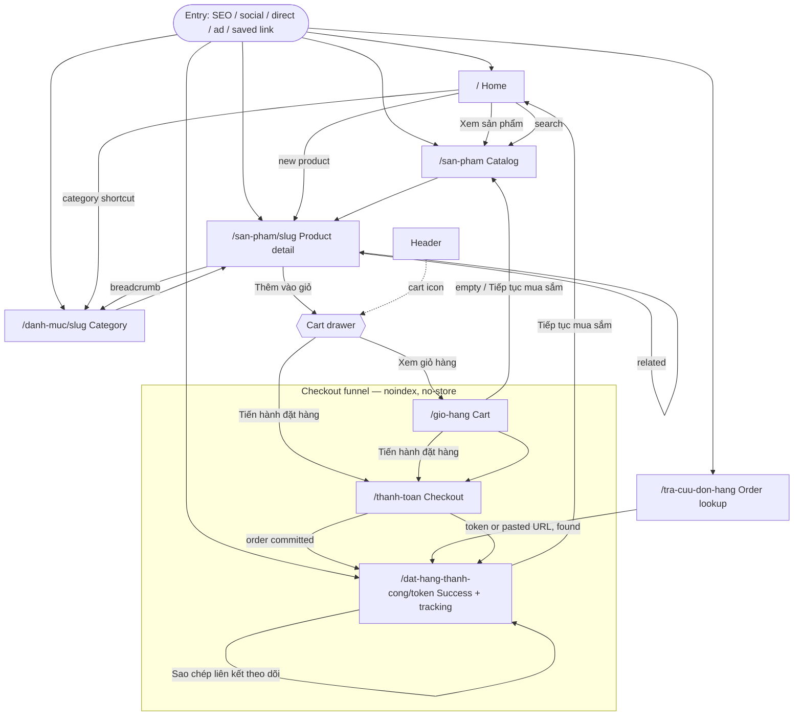
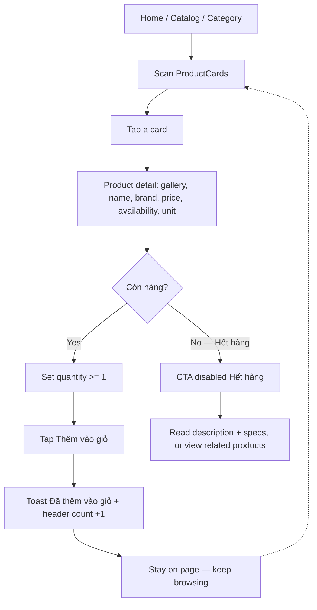
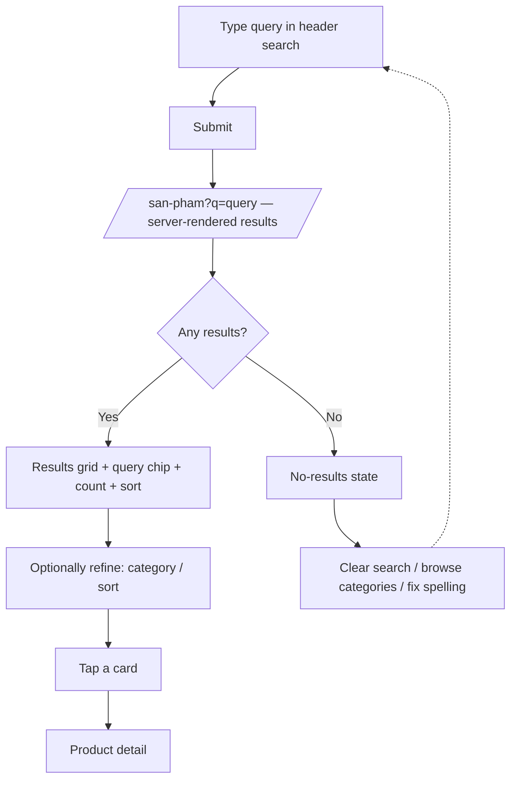
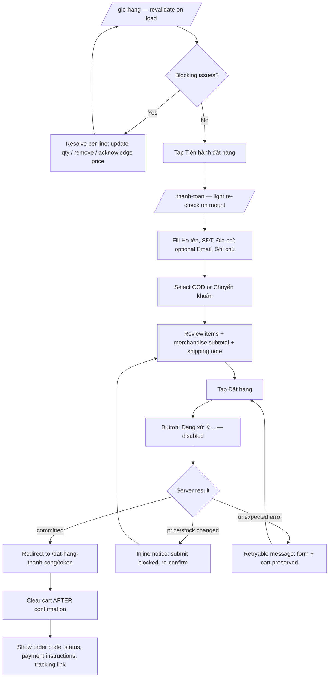
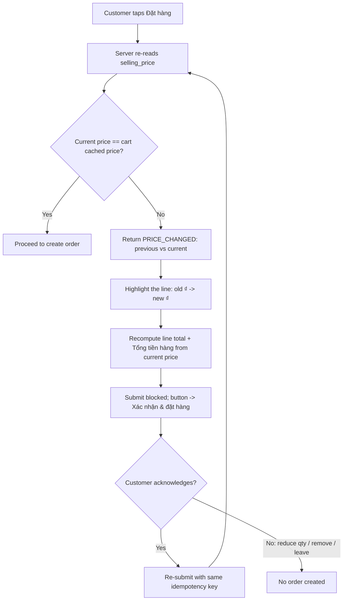
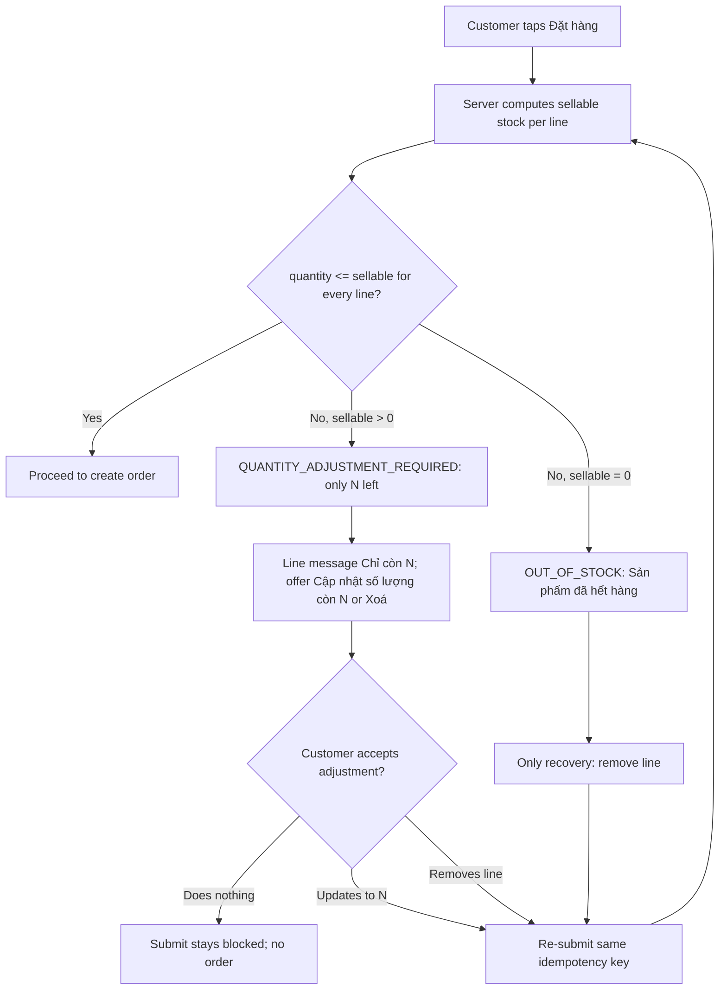
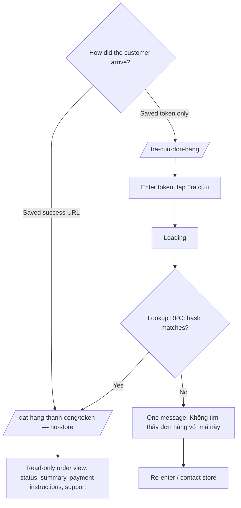
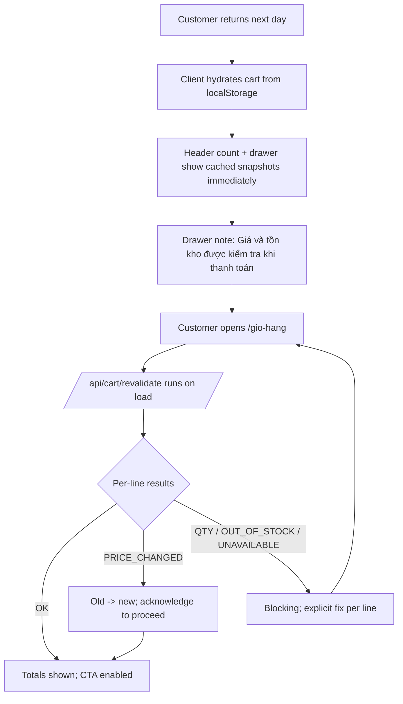
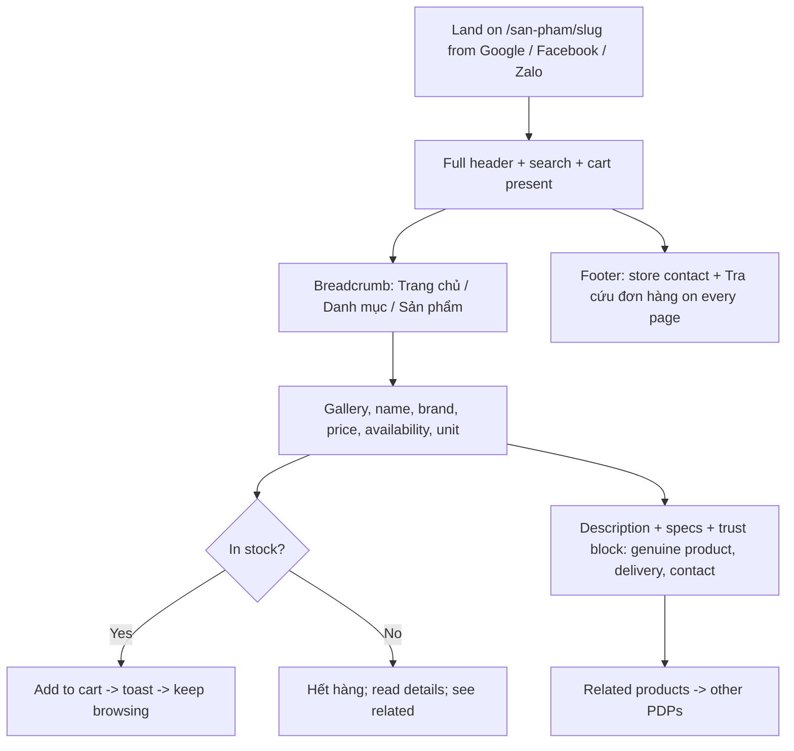
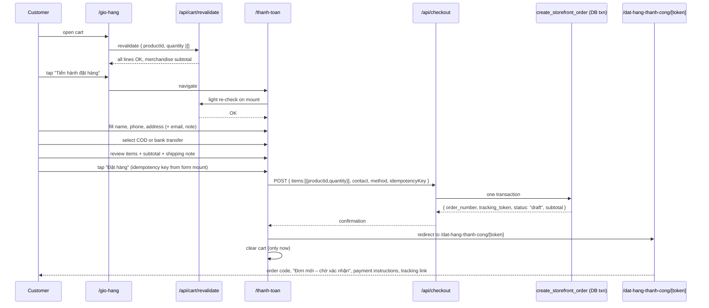

# Storefront Phase S2.1 — Information Architecture & User Flows

**Status:** Product/UX design. IA, page hierarchy, navigation, customer journeys, edge
flows, conceptual component + state inventory, mobile-first behavior. **No visual
design** — no colors, typography scale, spacing/radius/shadow tokens, Figma, moodboard,
or component styling. Those are S2.2 → S2.4.

**Inputs:** `CLAUDE.md`, `docs/S0-requirements-and-architecture.md` (the "S0 document"),
`docs/README.md`, and the skills `baby-wale-domain`, `ecommerce-ux`,
`mobile-first-storefront`, `storefront-ui-design`, `design-system`,
`visual-consistency`, `accessibility`, `nextjs-app-router`, `nextjs-server-components`,
`nextjs-seo`, `public-data-contract`, `checkout-security`, `cart-state`,
`vietnamese-ecommerce-ui`, `storefront-error-handling`. S1 code inspected for technical
boundaries only.

This document answers **"what does the customer need to see and do"**, not "what does
it look like". All copy below is **placeholder intent**, not final wording.

> **Approved refinements (applied 2026-09-10, from S2.2 §1–§2).** These clarify — not
> replace — the sections below:
> - **Sticky model (supersedes "max one sticky per screen" in §15.1):** a screen may
>   have **one compact persistent top navigation/header surface** *and* **at most one
>   bottom transactional/action sticky surface**. Product mobile = sticky header + one
>   Add-to-Cart bottom bar. Cart mobile = sticky header + one Checkout bottom bar.
>   **Checkout mobile = sticky header only; the submit stays in-flow** (no bottom
>   transactional bar) to avoid on-screen-keyboard conflict. Never stack two bottom
>   sticky bars; never have filter + CTA both sticky; sticky UI must not consume
>   excessive viewport height.
> - **Order-success actions (supersedes the "Theo dõi đơn hàng" primary CTA):** the
>   success page **is** the token tracking view, so it must not carry a primary button
>   that navigates to its own URL. Primary action = a **save/share affordance**
>   ("Sao chép liên kết theo dõi"); secondary = "Tiếp tục mua sắm". The current order
>   status stays visible on the page itself.
> - **Manual tracking input (`/tra-cuu-don-hang`):** accepts **either a raw tracking
>   token or a full Baby Wale tracking URL** the customer copied. The client/server may
>   extract the token from a valid Baby Wale URL before calling the token-lookup RPC.
>   Backend lookup security is unchanged; still **no `order_number`-only lookup**.
> - **Owner decisions D1–D3 are LOCKED:** D1 completed-order label = **"Đơn hàng đã được
>   xác nhận"** (never wording implying delivery); D2 no Add-to-Cart on `ProductCard`
>   (card opens detail); D3 Home uses a **static** hero/value block (no carousel). **D4
>   stays conditional** — no return/exchange policy is assumed or fabricated; the design
>   leaves room for future trust/policy content without showing fake placeholders in
>   production.

---

## Table of contents

1. [Customer & core journey](#1-customer--core-journey)
2. [Information architecture tree](#2-information-architecture-tree)
3. [Navigation — header, mobile pattern, footer](#3-navigation)
4. [Page inventory](#4-page-inventory)
5. [Product discovery — search, category, listing, filter, sort, pagination](#5-product-discovery)
6. [Product detail hierarchy](#6-product-detail-hierarchy)
7. [Out-of-stock behavior](#7-out-of-stock-behavior)
8. [Cart — entry, drawer vs page, empty, revalidation](#8-cart)
9. [Checkout — IA, single-page, summary, submit states](#9-checkout)
10. [Price-change & stock-change recovery flows](#10-price-change--stock-change-recovery)
11. [Order success & tracking](#11-order-success--tracking)
12. [Order status language & payment/shipping copy semantics](#12-status-language--copy-semantics)
13. [Trust & contact surfaces](#13-trust--contact-surfaces)
14. [Mobile & desktop content order](#14-content-order)
15. [Sticky UX & CTA hierarchy](#15-sticky-ux--cta-hierarchy)
16. [Breadcrumbs, back navigation, H1 map](#16-breadcrumbs-back-navigation-h1-map)
17. [Error / empty state inventory](#17-error--empty-state-inventory)
18. [Accessibility requirements per flow](#18-accessibility-requirements-per-flow)
19. [Navigation map & primary flow diagrams](#19-navigation-map--primary-flow-diagrams)
20. [Scenario flows (direct landing, search landing, returning cart, double submit, oversold)](#20-scenario-flows)
21. [Conceptual component inventory](#21-conceptual-component-inventory)
22. [Design-state inventory](#22-design-state-inventory)
23. [Copy tone guidelines](#23-copy-tone-guidelines)
24. [Content gaps (stakeholder input)](#24-content-gaps)
25. [Owner decisions](#25-owner-decisions)
26. [S2.2 design brief](#26-s22-design-brief)

---

## 1. Customer & core journey

### Primary customer (behavioral, not demographic)

- **Not logged in.** Guest browsing, guest checkout. No account concept exists in MVP.
- **Mobile-first.** Assume a ~390px phone, one hand, variable connection.
- **Arrives from anywhere** — a Facebook/Zalo post, a Google result, a shared link, a
  direct visit. **Not everyone starts at Home**; every page must stand on its own.
- **May not know product terminology.** Needs forgiving search and clear categories,
  not jargon.
- **Values trust and clarity** — genuine products, a real store behind the site, an
  easy way to ask a question.
- **Wants a short checkout** — minimal typing, COD or manual bank transfer, no forced
  signup.
- **May return via a tracking link** to check an order or re-read payment instructions.

### Core conversion journey (every IA decision serves this)

```
Home / any entry point
    → Browse / Search / Category
    → Product detail
    → Add to cart
    → Cart (review, resolve price/stock changes)
    → Checkout (contact + address + payment method, single page)
    → Order success (order code, payment instructions, tracking link)
    → Order tracking (status, summary)
```

Marketing sections, filters, and decoration are **subordinate** to this path.

---

## 2. Information architecture tree

Routes are fixed by the S0 URL contract; S2.1 does not add routes.

```
Baby Wale storefront
│
├── / ................................ Home
│   ├── Brand identity + value line
│   ├── Search entry (prominent)
│   ├── Category shortcuts ............ → /danh-muc/[slug]
│   ├── New products ("Sản phẩm mới")  → /san-pham/[slug]   (created_at desc, web-visible)
│   ├── Trust / store information
│   └── Contact / help (or folded into footer)
│
├── /san-pham ........................ Catalog listing
│   ├── Search state ................. ?q=
│   ├── Category filter .............. ?danh-muc=
│   ├── Sort ......................... ?sap-xep=  (moi-nhat | gia-tang | gia-giam)
│   ├── Pagination ................... ?trang=N   (page size ~24, server-side)
│   ├── Results summary + active-filter chips
│   └── ProductCard → /san-pham/[slug]
│
├── /danh-muc/[slug] ................. Category landing (SEO/shareable entry)
│   ├── Category name (H1) + optional short description
│   ├── Breadcrumb: Trang chủ / [Danh mục]
│   └── Same listing UI as /san-pham, pre-scoped to this category (sort + pagination)
│
├── /san-pham/[slug] ................. Product detail
│   ├── Breadcrumb: Trang chủ / [Danh mục] / [Sản phẩm]
│   ├── Image gallery (primary + thumbnails)
│   ├── Identity: name (H1), brand
│   ├── Price (selling_price, VND) — the ONLY price
│   ├── Availability: Còn hàng / Hết hàng   (no numbers)
│   ├── Unit / packaging (e.g. "Lon 800g")
│   ├── Quantity selector (min 1; max = last-known sellable, UX only)
│   ├── Add to cart  ("Thêm vào giỏ" | disabled "Hết hàng")
│   ├── Description
│   ├── Specs: xuất xứ / nhà sản xuất / nhà phân phối   (NEVER supplier, cost, batch)
│   ├── Delivery & payment note + store contact (trust block)
│   └── Related products (same category)
│
├── /gio-hang ....................... Cart (full page)
│   ├── Line items: image, name, unit, quantity stepper, line total, remove
│   ├── Per-line state: price changed / only n left / out of stock / unavailable
│   ├── Revalidation notice (summary, only when issues)
│   ├── Order totals: Tạm tính hàng hoá / Phí vận chuyển (note) / Tổng tiền hàng
│   └── "Tiến hành đặt hàng"  +  "Tiếp tục mua sắm"
│
├── /thanh-toan ..................... Checkout (single page, guest)
│   ├── Order summary (collapsed on mobile, sticky aside on desktop)
│   ├── Thông tin nhận hàng: Họ và tên*, Số điện thoại*, Địa chỉ nhận hàng*, Email, Ghi chú
│   ├── Phương thức thanh toán: COD | Chuyển khoản ngân hàng  (+ helper text)
│   ├── Xem lại đơn hàng: items, quantities, unit prices, merchandise subtotal
│   ├── Shipping-fee notice ("Phí vận chuyển sẽ được nhân viên xác nhận")
│   └── "Đặt hàng"  (stateful; disabled while pending; blocked on unresolved changes)
│
├── /dat-hang-thanh-cong/[token] .... Order success  (also the tracking view for that token)
│   ├── Confirmation heading ("Đặt hàng thành công")
│   ├── Order code (order_number) — the human reference
│   ├── Customer-facing status ("Đơn mới – chờ xác nhận")
│   ├── Payment instructions (COD note | bank-transfer details + memo = order_number)
│   ├── Order summary (items, quantities, unit prices, merchandise subtotal, shipping note)
│   ├── Tracking link (this same URL) + "Lưu lại đường dẫn này"
│   ├── Contact support
│   └── "Tiếp tục mua sắm"
│
├── /tra-cuu-don-hang ............... Order lookup (manual token entry)
│   ├── Token input (from a saved link)
│   ├── States: idle / loading / found / invalid-or-not-found
│   └── On found: renders the same read-only order view as the success page
│
└── /tai-khoan ...................... (NOT MVP — S12, customer accounts)
```

**Internal / never exposed anywhere in the storefront:** supplier, purchase price,
COGS, `default_purchase_price`, `tiktok_price`, `shopee_price`, `minimum_stock`, batch
IDs / quantities / expiry, import & invoice data, inventory transactions, staff data,
internal notes, raw order status enums, other customers' data. (`public-data-contract`,
CLAUDE.md §6.)

---

## 3. Navigation

### 3.1 Header IA (structure, not visuals)

**Job of the header:** identity, search, catalog access, cart. Nothing else competes.

| Element | Desktop | Mobile | Notes |
| --- | --- | --- | --- |
| Baby Wale logo | yes → `/` | yes → `/` (center) | Reuse existing brand asset; do not regenerate. |
| Search | persistent input, center | full-width field in a sub-row under the top bar | Primary task for customers unsure of terms. Always visible on mobile, not hidden behind an icon. |
| Catalog access | "Sản phẩm" link → `/san-pham` + a "Danh mục" affordance listing top categories → `/danh-muc/[slug]` | inside the hamburger drawer | Keep top-level nav to **one** primary link + category access. |
| Cart | icon + item count → opens **cart drawer** | icon + count (right) → opens cart drawer | Count hydrates client-side; server renders a neutral "Giỏ hàng" placeholder (`cart-state`). |
| Order tracking | small, de-emphasized "Tra cứu đơn hàng" link near the cart | inside the hamburger drawer | Low frequency; also in the footer. |
| Contact / help | "Liên hệ" in the nav or utility area | inside the hamburger drawer | Also in the footer. |
| **Login / account** | **omitted** | **omitted** | No customer accounts in MVP (CLAUDE.md §9 O10). No profile entry, no "Đăng nhập". |

The header is a **server-rendered shell** with a single small `"use client"` island for
the cart count (`cart-state`, `nextjs-server-components`).

### 3.2 Mobile navigation pattern — decision

**Chosen: A — header + hamburger**, with **search and cart promoted into the header
itself** (always-visible search sub-row; persistent cart icon + badge).

Hamburger drawer contents: `Trang chủ` · `Sản phẩm` · `Danh mục` (expandable list of
categories) · `Tra cứu đơn hàng` · `Liên hệ`.

**Why not B (bottom navigation):** the MVP task set is small and asymmetric. Home /
Products / Track-order are low-switch destinations; the two high-frequency tasks —
**Search** and **Cart** — already live in the persistent header. A bottom nav bar would
also collide with the screens that matter most: it stacks against the **sticky
Add-to-Cart bar** on product detail and the checkout CTA, producing two competing fixed
bars on mobile — exactly what `mobile-first-storefront` warns against ("avoid excessive
sticky surfaces").

**Why not C (hybrid / bottom bar only on some pages):** inconsistent navigation between
pages is disorienting and violates `visual-consistency` ("don't duplicate the same
navigation everywhere" / one system).

**What changes if B/C were chosen:** an extra always-mounted client component, a
reserved bottom inset on every page, and a rule for how it coexists with per-screen
sticky CTAs. Not worth it for five destinations, three of which are rare.

### 3.3 Footer IA

Groups (omit any group whose content the business has not provided — do not fabricate):

- **Baby Wale** — logo + one identity line ("Cửa hàng mẹ và bé").
- **Cửa hàng / Liên hệ** — address, phone, opening hours, Zalo / Facebook. *(stakeholder input — §24)*
- **Liên kết nhanh** — Sản phẩm, Danh mục (top few), Giỏ hàng, Tra cứu đơn hàng.
- **Chính sách** — đổi/trả, vận chuyển. *(only if the business has real policies — §24)*
- Copyright line.
- **No account link.**

The footer is the single always-available place for store contact and order tracking on
every page, including direct-landing scenarios.

---

## 4. Page inventory

| Route | Purpose | Primary user goal | Primary CTA | Secondary actions | Required content | Important states | Mobile notes | SEO / indexing |
| --- | --- | --- | --- | --- | --- | --- | --- | --- |
| `/` | Orient the customer; route them into the catalog | "Show me what this store sells / let me search" | **Xem sản phẩm** | Search; category shortcuts; tap a new product | Brand identity + value line; search; category shortcuts; new products; trust block; footer contact | data-unavailable (degrade sections independently); empty "new products" | Above-the-fold must fit identity + search + a commerce entry; no carousel | **Indexable.** Title `Baby Wale`. `Organization` JSON-LD later (S13). |
| `/san-pham` | Browse / search all web-visible products | "Find a product to open" | ProductCard → detail (the cards *are* the CTA) | Search; category filter; sort; pagination; clear filters | Results grid; result count; active-filter chips; sort control; pagination; empty/no-results state | loading (skeletons); no products; no search results; error | Filters/sort behind "Danh mục" / "Sắp xếp" sheet triggers; 1–2 column grid | Base list **indexable**; `?q=` and multi-facet combos `noindex, follow`; `?trang=N` self-canonical (`nextjs-seo`). |
| `/danh-muc/[slug]` | Category landing (shareable / SEO entry) | "Browse this category" | ProductCard → detail | Sort; pagination; (search within optional) | Category name (H1); optional short description; breadcrumb; same listing UI scoped to category | same as `/san-pham` + category-not-found | Same as catalog | **Indexable**, self-canonical. `/san-pham?danh-muc=x` (no other params) → canonical to `/danh-muc/x`. |
| `/san-pham/[slug]` | Present one product; enable add-to-cart | "Understand this product and buy it" | **Thêm vào giỏ** (or disabled **Hết hàng**) | Change quantity; open gallery; tap a related product; breadcrumb; contact | Gallery; name (H1); brand; price; availability; unit; quantity; add-to-cart; description; specs (origin/manufacturer/distributor); trust block; related products | loading; not-found (404/410 for archived/non-visible); out-of-stock; image-missing | Sticky bottom add-to-cart bar; gallery swipeable; specs below the fold | **Indexable.** `generateMetadata` (name + brand, trimmed description, canonical, OG = public image). `Product` + `Offer` JSON-LD (`priceCurrency: "VND"`, availability from stock) — designed now, built S4. |
| `/gio-hang` | Review & correct the cart; gate to checkout | "Confirm what I'm ordering and the price" | **Tiến hành đặt hàng** | Change quantity; remove line; continue shopping; acknowledge price change; accept quantity reduction | Line items; per-line status; revalidation notice; order totals (merchandise subtotal, shipping note); empty state | empty cart; cached/stale (pre-revalidation); price changed; quantity adjustment required; out of stock; product unavailable; revalidation error | Sticky "Tiến hành đặt hàng" bar with subtotal; roomy tap targets on steppers/remove | **`noindex`** + in `robots.ts` disallow (`nextjs-seo`, S1 `robots.ts`). |
| `/thanh-toan` | Collect contact/address/payment; place the order | "Give my details and place the order with confidence" | **Đặt hàng** | Back to cart; edit a field; expand order summary; choose payment method; re-confirm a changed price/quantity | Order summary; contact & shipping form (name*, phone*, address*, email, note); payment method (COD / bank transfer) + helper; review list; shipping-fee notice; reassurance line | idle; invalid (field errors); revalidating; submitting/pending; price changed; stock changed; server error (retryable); success (redirect) | Single page; collapsed summary at top; one full-width submit at the end; keyboard must not hide submit | **`noindex`** + disallow. |
| `/dat-hang-thanh-cong/[token]` | Confirm receipt; give payment instructions & tracking | "Did it go through? How do I pay? How do I check later?" | **Sao chép liên kết theo dõi** (save/share; no self-navigating "Theo dõi" button) | Save/share the link; read payment instructions; contact support; continue shopping | Confirmation heading; order code; customer-facing status; payment instructions (method-specific); order summary; tracking link + "save this link"; support contact | loading; found; token invalid / not found; (bank-transfer vs COD variants) | Payment instructions prominent for bank transfer; link easy to copy | **`noindex`** + disallow. Rendered `no-store`. |
| `/tra-cuu-don-hang` | Look up an order by its tracking token | "Check my order using the link/code I saved" | **Tra cứu** | Paste token; retry; contact support; continue shopping | Token input + label + help text; result view = same read-only order view as success page | idle; loading; found; invalid-or-not-found (single combined message); error | Simple one-field form; large input; `type`/`inputmode` sensible | **`noindex`** + disallow. **No lookup by `order_number` alone** (`frontend-storefront-security`). |
| `not-found` / `error` (framework) | Graceful dead-end recovery | "Get back to somewhere useful" | **Về trang chủ** | Search; browse categories; retry (error only) | Short Vietnamese message; safe navigation; no stack trace | 404; generic route error (client backstop) | Full-height, minimal | `not-found` may be `noindex`; error page is `noindex`. |

---

## 5. Product discovery

### 5.1 Search flow

Entry: the header search field (always visible on mobile, persistent on desktop).

```
type query → submit (Enter / search button)
    → navigate to /san-pham?q=<query>  (URL is the state)
    → server renders results scoped to q, with sort + category filter still available
```

**States:**

| State | Behavior |
| --- | --- |
| typing | Local field value only. **No typeahead / suggestions in MVP** (deferred; not justified for a small catalog — adds a client round-trip surface and a11y/keyboard complexity). |
| submitted | Navigate to `/san-pham?q=...`; loading skeletons in the results region. |
| results | H1 becomes `Kết quả cho "<query>"`; the query echoes in the field and as a removable chip; result count shown; sort + category filter operate within the query. |
| no results | Dedicated empty state: "Không tìm thấy sản phẩm phù hợp với '<query>'." Recovery: clear search (→ `/san-pham`), browse categories, check spelling. Never a blank grid. |
| malformed / empty query | Submitting an empty/whitespace query does **not** create a `?q=`; it navigates to `/san-pham` (all products). Query length is capped and delimiter-sanitized server-side before the `ILIKE` (`frontend-storefront-security`). |
| clear search | An "✕" on the query chip / a "Xoá tìm kiếm" link removes `?q=` and keeps other params (category, sort). |

Search resets `?trang=` to page 1.

### 5.2 Category flow — two surfaces, one model

| Surface | When used | Behavior |
| --- | --- | --- |
| `/danh-muc/[slug]` | Home category shortcuts, header "Danh mục" list, breadcrumbs, external/SEO links | A real landing page: own H1 (category name), optional short description, breadcrumb, self-canonical. Renders the **same listing UI** as `/san-pham`, pre-scoped to the category. Sort + pagination work; the category is fixed (not a removable chip here). |
| `/san-pham?danh-muc=<slug>` | The category **filter control** on the catalog page | Applies the category as one facet that composes with `?q=`, `?sap-xep=`, `?trang=`. Shown as a removable chip. |

**Relationship rule:** both routes feed **one `ProductListing` module** a category
constraint — there is no second category experience. Canonicalization (S4/S13):
`/danh-muc/[slug]` is canonical for a pure category view; `/san-pham?danh-muc=x` with no
other params canonicalizes to `/danh-muc/x`; once `?q=` or a non-default sort is added,
the catalog URL is the one in use and gets `noindex, follow`.

### 5.3 Product listing content priority (ProductCard)

A card **must** communicate, in priority order:

1. **Image** (real product photo, consistent aspect ratio, meaningful `alt`).
2. **Product name** (may wrap to 2 lines, then truncate).
3. **Brand** (when it aids recognition — most baby products).
4. **Price** (VND, one price).
5. **Unit / packaging** when it changes meaning (e.g. "Lon 800g", "Bịch 64 miếng").
6. **Availability** — `Còn hàng` / `Hết hàng` (text + icon, never color alone).
7. **Affordance to open detail** — the whole card is a link; an explicit "Xem chi
   tiết" for clarity and as a keyboard-focusable target.

**Direct "Thêm vào giỏ" on listing cards — recommendation: NOT in MVP.**
Baby products frequently require reading the unit/size/stage before buying (formula
stage, diaper size, volume, pack count); mobile card space is tight; a per-card
enabled/disabled add button multiplies state and mis-tap risk. The critical flow is
preserved: tap card → detail → add. Revisit post-launch if analytics show drop-off
between listing and detail. *(Listed as a light owner confirmation — §25.)*

### 5.4 Filter UX

MVP facets: **category** (single-select) and **sort**. Search is separate query state.

| Viewport | Interaction |
| --- | --- |
| Desktop | A control row above the grid: category (dropdown or short list), sort (dropdown), result count, and removable chips for active category/query. |
| Mobile | Two compact triggers — **"Danh mục"** and **"Sắp xếp"** — each opening a bottom sheet of radio options; selection applies (with an "Áp dụng" button in the sheet). Active selections show as chips beneath the trigger row. Keep to one row of controls. |

Every change writes URL params; changing category / sort / query resets `?trang=1`.
The sheet manages focus (open → trap → return to trigger; `Esc` closes).

### 5.5 Sort UX

| Param value | Customer label |
| --- | --- |
| `moi-nhat` (default) | **Mới nhất** |
| `gia-tang` | **Giá: Thấp đến cao** |
| `gia-giam` | **Giá: Cao đến thấp** |

No "Bán chạy" / best-selling sort in MVP (O6 deferred).

### 5.6 Pagination UX

- **Server-side, page-number**, page size ~24 (S0 C16). `?trang=N`; page 1 omits the
  param.
- Controls: **"Trước" / "Sau"** always present; numbered pages **on desktop** (with
  ellipsis for many pages). **Mobile**: compact — "Trước · Trang N / M · Sau". No long
  number row on small screens. Not infinite scroll.
- On page change: update URL, re-render on the server, and move focus to the results
  heading / top of the grid (a11y + orientation).
- Filter / sort / query change → back to page 1.

### 5.7 Back navigation

All discovery state (`q`, `danh-muc`, `sap-xep`, `trang`) lives in **URL search
params**, read on the server. Browser **Back** restores the previous URL and therefore
the previous results exactly — no custom history/state that fights the browser
(`nextjs-app-router`, CLAUDE.md §10). The cart drawer is ephemeral UI state and does
**not** create history entries.

---

## 6. Product detail hierarchy

Content priority (this is DOM/reading order on mobile; see §14 for the two-column
desktop mapping):

**Above the fold (mobile):**

1. Breadcrumb (compact) — `‹ [Danh mục]` with the full trail available.
2. **Image gallery** — primary image + thumbnail strip; swipeable; tap to enlarge.
3. **Product name** — the page `<h1>`.
4. **Brand**.
5. **Price** — `selling_price`, VND, prominent. The only price.
6. **Availability** — `Còn hàng` / `Hết hàng` (text + icon).
7. **Unit / packaging** — e.g. "Lon 800g".
8. **Quantity selector** — stepper, min 1, max = last-known sellable (UX only; real
   check at revalidation/checkout).
9. **Add to cart** — "Thêm vào giỏ" (primary) or disabled "Hết hàng".

**Below the fold:**

10. Short key highlights (optional, concise — no wall of bullets).
11. **Description** (full).
12. **Specs** — xuất xứ (origin), nhà sản xuất (manufacturer), nhà phân phối
    (distributor). **Never** supplier, cost, batch, expiry, or internal stock numbers.
13. **Trust block** — delivery & payment summary ("Giao hàng toàn quốc • COD hoặc
    chuyển khoản • Nhân viên xác nhận đơn"), genuine-product reassurance, store contact.
14. **Related products** — same category strip.
15. Footer.

The product page is **fully self-sufficient** for a direct landing (see §20.1): header,
breadcrumb to category + home, trust block, cart access, related products, footer
contact — no assumption the customer saw Home first.

---

## 7. Out-of-stock behavior

Decision (S0 B1/B4, `ecommerce-ux`): **out-of-stock products stay visible.**

| Surface | Behavior |
| --- | --- |
| ProductCard | Show **"Hết hàng"** badge (text + icon). Card still links to detail. No add affordance regardless (per §5.3 there is none on cards). |
| Product detail | Show **"Hết hàng"** in the availability slot. The primary CTA renders **disabled** with the label **"Hết hàng"** (not hidden — keeps layout stable and intent clear). Quantity selector disabled. |
| Product detail — compensating | **Related products** get slightly more prominence (e.g. shown earlier / expanded) so the customer has a path forward. The full description/specs remain readable — the customer can still evaluate the product and bookmark it. |
| Breadcrumb / nav | Unchanged — the customer can go back to the category and keep shopping. |

**No back-in-stock notifications in MVP** (no email capture, no subscribe control).

Availability is a **label, never a number** — no "còn 2 cái", no "sắp hết hàng" (the
latter is deferred and must never be derived from `minimum_stock`).

---

## 8. Cart

### 8.1 Cart entry points

- **Product detail → "Thêm vào giỏ"** — the only add path in MVP.
- (ProductCard add — not in MVP; §5.3.)

**After adding — recommendation: B, toast + stay on page.**

- A brief confirmation toast: **"Đã thêm vào giỏ"**, with a **"Xem giỏ hàng"** action.
- The **header cart count** updates immediately.
- On the product page, a subtle inline confirmation near the add button ("Đã thêm vào
  giỏ") in addition to the toast.
- **Do not** auto-open the cart drawer (interrupts browsing, steals focus, costly on
  mobile) and **do not** navigate to the cart (kills "keep shopping").
- The cart **drawer opens only on an explicit tap** of the cart icon.

### 8.2 Cart drawer vs cart page — one model, two surfaces

| | **Cart drawer** | **Cart page `/gio-hang`** |
| --- | --- | --- |
| Opened from | Cart icon, anywhere | Cart icon → "Xem giỏ hàng"; toast action; header count; direct link |
| Purpose | Quick glance, small edits, fast route to checkout | Full review, resolve price/stock issues, longer lists |
| Contents | Line items (image, name, unit, qty stepper, line total, remove), merchandise subtotal, "Xem giỏ hàng", **"Tiến hành đặt hàng"** | Same line-item model + per-line status messaging, revalidation notice, order totals block, **"Tiến hành đặt hàng"**, "Tiếp tục mua sắm" |
| Revalidation | **Does not** run full revalidation on open (kept cheap). Shows cached snapshots + a note: "Giá và tồn kho được kiểm tra khi thanh toán." | **Runs `/api/cart/revalidate` on load** (`no-store`) and shows authoritative per-line state |
| Focus/scroll | Dialog: focus in, trap, `Esc` / tap-out / close button, return focus to the cart icon | Normal page; focus moves to H1 on load |

Both render the **same `CartLineItem`** from the **same Zustand store** (`cart-state`) —
the drawer is a compact projection, not a second cart concept.

### 8.3 Empty cart

Empty state (drawer and page): a short friendly line — **"Giỏ hàng của bạn đang
trống."** — plus **"Xem sản phẩm"** (→ `/san-pham`) and category shortcuts. Never a
dead end.

### 8.4 Cart revalidation UX (`/api/cart/revalidate` line statuses)

Runs on `/gio-hang` load and again as the checkout entry gate (§9.1). Per line:

| Status | Line message (intent) | Blocking? | Checkout CTA | Customer recovery |
| --- | --- | --- | --- | --- |
| `OK` | — | no | enabled | — |
| `PRICE_CHANGED` | "Giá đã thay đổi: ~~180.000 ₫~~ → **185.000 ₫**." Subtotal recomputed with a "đã cập nhật" note. | **Soft-block** — must acknowledge | relabels to **"Xác nhận giá mới & tiếp tục"**; a plain re-tap = the acknowledgement | Accept new price (proceed) · reduce quantity · remove line |
| `QUANTITY_ADJUSTMENT_REQUIRED` | "Chỉ còn **3** sản phẩm cho mặt hàng này." | **Blocking** | disabled until resolved | Tap **"Cập nhật số lượng còn 3"** (explicit) · remove line. **Never auto-reduced.** |
| `OUT_OF_STOCK` | "Sản phẩm đã hết hàng." | **Blocking** | disabled until resolved | Remove line (may keep browsing to the product) |
| `PRODUCT_UNAVAILABLE` | "Sản phẩm hiện không còn được bán." | **Blocking** | disabled until resolved | Remove line |

Multiple issues → a summary notice at the top: **"Một vài sản phẩm cần được xem lại
trước khi đặt hàng."** + per-line detail. The CTA is enabled only when **no blocking
issue remains** and **every price change has been acknowledged**.

**Never** silently raise a price and proceed. **Never** silently change a quantity.

---

## 9. Checkout

### 9.1 Checkout entry gate

**Recommendation: revalidate at the cart page (blocking gate), and re-check on checkout
load and at submit.**

- `/gio-hang` runs revalidation on load; **"Tiến hành đặt hàng"** is enabled only when
  clean (or re-runs and blocks) — the customer resolves stock/price issues *before*
  investing effort typing their details.
- `/thanh-toan` **re-runs a lightweight check on mount** as a safety net; normally
  clean by then.
- The **server RPC re-checks authoritatively at submit** (`checkout-security`). If a
  change appears between cart and submit, checkout surfaces it **inline** and **blocks
  the final submit** until re-confirmed — the customer never meets a brand-new stock
  problem for the first time only *after* pressing "Đặt hàng" with no chance to review.

### 9.2 Checkout information architecture — single page

**Recommendation: single-page checkout** (not multi-step). Guest, three required
fields, two payment options, one summary — multi-step adds navigation cost with no
benefit at this size. Logical sections on one page:

1. **Order summary** — collapsed on mobile (shows "N sản phẩm • Tổng tiền hàng …",
   expandable); sticky aside on desktop. Placed before the form so totals are visible
   before typing.
2. **Thông tin nhận hàng** — `Họ và tên`*, `Số điện thoại`* (`type="tel"`,
   `inputmode="numeric"`), `Địa chỉ nhận hàng`* (single free-text field, matches
   `customers.address`), `Email` (optional), `Ghi chú` (optional).
3. **Phương thức thanh toán** — radio: **Thanh toán khi nhận hàng (COD)** /
   **Chuyển khoản ngân hàng**, each with one helper line (§12).
4. **Xem lại đơn hàng** — full item list (name, unit, quantity, unit price, line
   total), merchandise subtotal, shipping-fee notice.
5. **Đặt hàng** — full-width submit at the end; reassurance line under it
   ("Nhân viên sẽ liên hệ xác nhận đơn hàng.").

Client Zod validates shape/required/phone-format for UX; the Route Handler re-validates;
the DB/RPC is authoritative (`checkout-security`, `react-hook-form-zod`).

### 9.3 Checkout order summary — what stays visible

- Products: name, unit, quantity, **unit price**, line total.
- **Tạm tính (hàng hoá)** — merchandise subtotal (authoritative merchandise figure).
- **Phí vận chuyển: Nhân viên sẽ xác nhận** — never a number, never folded in.
- **Tổng tiền hàng** — the merchandise sum. **Not** labelled "Tổng thanh toán" /
  "Thành tiền" (those imply an all-in amount incl. shipping — forbidden until shipping
  accounting is finalized; CLAUDE.md §8, S0 B11).
- Payment method (once selected).
- **No** internal fields — no order id, no `source`, no `payment_status` enum, no COGS,
  no batch data.

### 9.4 Checkout submit — states

| State | Button | Rest of UI | Customer certainty |
| --- | --- | --- | --- |
| idle | **"Đặt hàng"** enabled (when form valid + cart clean) | — | "I can place this now." |
| invalid | disabled **or** enabled-that-reveals-errors; on press, focus jumps to the first invalid field | field-level errors, associated with inputs, announced | "I know exactly what to fix." |
| revalidating cart | **"Đang kiểm tra giỏ hàng…"**, disabled + spinner | summary shows a checking indicator | "It's verifying, not stuck." |
| submitting | **"Đang xử lý…"**, disabled + spinner; stays disabled until a response | inputs read-only | "It's working — I won't press again." |
| price changed | submit **blocked**; inline notice with old→new + updated total; button becomes **"Xác nhận & đặt hàng"** after the customer acknowledges | affected line highlighted | "The price changed; I choose to continue or not." |
| stock changed | submit **blocked**; inline notice ("Chỉ còn N…" / "Đã hết hàng"); explicit fix action | affected line highlighted | "I must adjust before ordering." |
| server error (unexpected) | returns to **"Đặt hàng"** enabled; a retryable notice: "Không thể tạo đơn hàng. Vui lòng thử lại." | **form values and cart preserved** | "Nothing was lost; I can retry." |
| success | — (navigates to `/dat-hang-thanh-cong/[token]`) | — | "It went through — here's my order code." |

**Success is shown only from the server confirmation** — never optimistically
(`checkout-security`). The cart is cleared **only after** the committed confirmation.

---

## 10. Price-change & stock-change recovery

### 10.1 Price change (exact flow)

Example: cart cached `180.000`, server current `185.000`.

```
revalidate (cart load, checkout mount, or submit) → line status PRICE_CHANGED
   previousUnitPrice 180.000, currentUnitPrice 185.000
→ the line is visually flagged: "Giá đã thay đổi"
→ show both: ~~180.000 ₫~~  →  185.000 ₫
→ recompute the line total and the merchandise subtotal from CURRENT prices,
   with a note "Đã cập nhật theo giá mới"
→ the primary CTA requires an explicit step:
     cart page:  "Xác nhận giá mới & tiếp tục"
     checkout:   submit blocked; button → "Xác nhận & đặt hàng" after acknowledgement
→ NOTHING is submitted automatically. No acknowledgement → no order.
→ at submit, the server re-checks; if it changed again, the same inline flow repeats
   and blocks the final submit until re-confirmed.
→ alternatives offered on the line: reduce quantity · remove line
```

Never silently charge the higher price; never auto-submit after a change.

### 10.2 Stock reduction (exact flow)

Example: customer requested `5`, now only `3` sellable.

```
revalidate → line status QUANTITY_ADJUSTMENT_REQUIRED
   requestedQuantity 5, sellableQuantity 3
→ line message: "Chỉ còn 3 sản phẩm cho mặt hàng này."
→ primary offered action: button "Cập nhật số lượng còn 3"
   secondary: "Xoá khỏi giỏ"
→ the quantity is NOT reduced automatically
→ the customer taps to accept the reduction (or removes the line)
→ only then does the line clear its blocking state; subtotal updates
→ the checkout CTA stays disabled while any line is in this state
→ server re-checks at submit; same inline treatment; final submit blocked until resolved
```

If sellable is `0` → `OUT_OF_STOCK`: line shows "Sản phẩm đã hết hàng.", the only
recovery is remove; CTA blocked until removed.

**Principle:** no financially meaningful change (quantity, price, total) happens without
an explicit customer action.

---

## 11. Order success & tracking

### 11.1 Order success page `/dat-hang-thanh-cong/[token]`

Hierarchy:

1. **Confirmation heading** — **"Đặt hàng thành công"** (H1). Means *order received &
   submitted*, not *paid* and not *guaranteed shipped* (see §20.5).
2. **Order code** — `order_number` (e.g. `ORD-001`), the human reference; also the
   bank-transfer memo.
3. **Customer-facing status** — **"Đơn mới – chờ xác nhận"** + one line: "Nhân viên sẽ
   liên hệ với bạn để xác nhận đơn hàng."
4. **Payment instructions** (method-specific):
   - **COD** — "Bạn thanh toán bằng tiền mặt khi nhận hàng. Nhân viên sẽ xác nhận đơn
     và phí vận chuyển trước khi giao."
   - **Bank transfer** — bank name / account name / account number / branch
     *(stakeholder — O8, §24)*, **transfer memo = the order code**, and "Đơn hàng được
     xử lý sau khi cửa hàng xác nhận đã nhận chuyển khoản." **Payment is not marked
     complete.**
5. **Order summary** — items, quantities, unit prices, merchandise subtotal, shipping
   note. (Read-only; safe fields only.)
6. **Tracking link (save/share affordance)** — this same URL; primary action
   **"Sao chép liên kết theo dõi"** (copy) plus a "Lưu lại đường dẫn này để theo dõi
   đơn hàng" hint. Since there is no account, the link is the customer's only handle.
   **Do not** render a "Theo dõi đơn hàng" button that navigates to this same URL —
   the status is already on this page.
7. **Contact support** — phone / Zalo.
8. **"Tiếp tục mua sắm"** (→ Home) — the secondary action.

The page is rendered `no-store` and reads the order back **by token** through the safe
lookup RPC — safe fields only, no order UUID, no internal data.

### 11.2 Order tracking `/tra-cuu-don-hang`

For customers who saved the link but not the page. One field that accepts **either a
raw tracking token or a full Baby Wale tracking URL** the customer pasted; the
client/server extracts the token from a valid Baby Wale URL before calling the
token-lookup RPC (backend lookup security unchanged).

| State | Behavior |
| --- | --- |
| idle | One field: "Nhập mã theo dõi hoặc dán liên kết theo dõi đơn hàng" + short help text. Submit: **"Tra cứu"**. |
| loading | Inline spinner / skeleton; field disabled. |
| found | Renders the **same read-only order view** as the success page (status, summary, payment instructions, support). |
| invalid / not found | **One combined, non-revealing message**: "Không tìm thấy đơn hàng với mã này. Vui lòng kiểm tra lại đường dẫn hoặc liên hệ cửa hàng." (Do not distinguish "malformed" vs "no such order" — avoids probing.) Recovery: re-enter, contact support. |
| error (unexpected) | "Không thể tra cứu lúc này. Vui lòng thử lại sau." (retryable) |

**No lookup by `order_number` alone** — order enumeration is prevented; the token is
unguessable and only its hash is stored (`frontend-storefront-security`, S0 B13). An
optional weaker `order_number` + `phone` fallback is **out of MVP scope** (S0 B13
recommends token-only).

---

## 12. Status language & copy semantics

### 12.1 Order status → customer label

| Internal (`orders.status`, `source='website'`) | S0 wording | **Customer label (approved)** | Rationale |
| --- | --- | --- | --- |
| `draft` | "Đơn mới – chờ xác nhận" | **"Đơn mới – chờ xác nhận"** (keep) | Clear; sets the right expectation (staff will confirm). |
| `completed` | "Đã xử lý / hoàn tất" | **"Đơn hàng đã được xác nhận"** — **LOCKED (D1)** | In MVP there is no delivery-tracking state; admin `complete_order` means *accepted / stock allocated / now real*, **not** *delivered*. "hoàn tất / completed" reads as "delivered/done" to a customer and over-promises. Never use "Đã giao" or wording implying delivery. DB enums unchanged. |
| `cancelled` | "Đã huỷ" | **"Đã huỷ"** (keep) | Clear. Pair with "Vui lòng liên hệ cửa hàng nếu bạn cần hỗ trợ." |
| `confirmed` | (unused by the web flow) | not surfaced | The website flow goes `draft → completed`/`cancelled`. |

Never show raw enum values (`draft`, `completed`, `unpaid`, `website`) or error codes
to customers (`vietnamese-ecommerce-ui`).

### 12.2 Payment copy semantics

| Method | Label | Helper line | Never say |
| --- | --- | --- | --- |
| COD | **"Thanh toán khi nhận hàng (COD)"** | "Bạn thanh toán bằng tiền mặt cho nhân viên khi nhận hàng." | — |
| Bank transfer | **"Chuyển khoản ngân hàng"** | "Chuyển khoản theo thông tin hiển thị sau khi đặt hàng; nội dung chuyển khoản ghi mã đơn. Cửa hàng xác nhận khi nhận được thanh toán." | — |
| Any, at order creation | — | — | **"Đã thanh toán"** / any paid state. The order is created unpaid; payment is confirmed by staff later. Prefer showing **method + instructions**, not a paid/unpaid badge, on success/tracking. |

### 12.3 Shipping copy semantics

Always render the amounts as three distinct lines — never a single implied grand total:

```
Tạm tính (hàng hoá):     1.234.000 ₫
Phí vận chuyển:           Nhân viên sẽ xác nhận
────────────────────────────────────────────
Tổng tiền hàng:           1.234.000 ₫
```

- The sum line is **"Tổng tiền hàng"** (merchandise total), **not** "Tổng thanh toán" /
  "Thành tiền".
- One note nearby: "Phí vận chuyển (nếu có) sẽ được nhân viên thông báo khi xác nhận
  đơn."
- Never fold shipping into product prices; never present shipping as finalized
  (CLAUDE.md §8, S0 B11).

---

## 13. Trust & contact surfaces

| Surface | What appears |
| --- | --- |
| **Footer** (every page) | Store address, phone, opening hours, Zalo/Facebook; "Tra cứu đơn hàng"; policies (only if provided). |
| **Product detail — trust block** | Delivery & payment summary ("Giao hàng toàn quốc • COD / chuyển khoản • Nhân viên xác nhận đơn"), genuine-product reassurance ("Sản phẩm chính hãng, có nguồn gốc rõ ràng"), store contact link. |
| **Home — trust section** | Condensed version of the above + a short "why buy here" line. |
| **Checkout** | Reassurance line under submit ("Nhân viên sẽ liên hệ xác nhận đơn hàng."), support contact. |
| **Order success / tracking** | Support contact (phone / Zalo), how confirmation works, payment instructions. |
| **Optional `/lien-he`** | A lightweight contact page **only if** the business supplies enough content (map, hours, channels). Not added in S2.1; header/footer "Liên hệ" can anchor to the footer until then. |

**Do not invent guarantees or policies** (returns window, delivery times, price-match,
authenticity certificates) the business has not provided. Missing items are stakeholder
input (§24), rendered as placeholders or omitted — never fabricated.

---

## 14. Content order

**Rule:** logical **DOM order = reading order**. Two-column desktop layouts are achieved
with CSS grid/flex placement, **not** by reordering the DOM into a confusing tab order
(`accessibility`, mobile-first skill).

### 14.1 Product detail

**Mobile DOM order:** breadcrumb → gallery → name (H1) → brand → price → availability →
unit → quantity → add-to-cart → highlights → description → specs → trust block →
related products → footer.

**Desktop:** two columns below the breadcrumb — **left: gallery**, **right: purchase
panel** (name/H1, brand, price, availability, unit, quantity, add-to-cart, short trust
snippet). Full-width below: description → specs → related. DOM stays *gallery → purchase
panel → description → specs → related*; the gallery's DOM footprint is kept small (one
main image + a thumbnail list) so a screen-reader user reaches the H1 quickly.

### 14.2 Cart (`/gio-hang`)

**Mobile DOM order:** H1 "Giỏ hàng" → revalidation summary notice (only if issues) →
line-items list (each: image, name, unit, quantity stepper, line total, remove, per-line
status) → order totals (Tạm tính hàng hoá / Phí vận chuyển note / Tổng tiền hàng) →
"Tiến hành đặt hàng" → "Tiếp tục mua sắm" → footer. Empty state replaces the list +
totals + CTA.

**Desktop:** line items in the main column; order totals + CTA as a panel to the side
(DOM order unchanged — totals panel comes after the list).

### 14.3 Checkout (`/thanh-toan`)

**DOM order (both viewports):** H1 "Thanh toán" → order summary → payment/contact form
sections (Thông tin nhận hàng → Phương thức thanh toán → Xem lại đơn hàng) → blocking
notice (if any) → "Đặt hàng" → reassurance line → minimal footer.

**Mobile:** the order summary renders **collapsed** at the top (expandable). **Desktop:**
the same summary block is placed as a **sticky right aside**; the form occupies the left
column. One DOM order serves both.

---

## 15. Sticky UX & CTA hierarchy

### 15.1 Sticky surfaces — the two-tier rule

**A screen may have one compact persistent top navigation/header surface AND at most
one bottom transactional/action sticky surface — nothing more.** (Approved refinement,
S2.2 §1A; supersedes the earlier "max one sticky per screen".)

| Surface | Mobile | Desktop | Verdict |
| --- | --- | --- | --- |
| Header (top tier) | Sticky, **compact** — search + cart always reachable; must not consume excessive height. | Sticky optional (compact). | Always allowed as the top tier. |
| Product detail — Add-to-Cart bar (bottom tier) | **Yes** — the one bottom transactional surface; appears after the in-flow purchase block scrolls away; shows price + quantity + "Thêm vào giỏ" (or disabled "Hết hàng"). | Purchase panel **sticks within the viewport** as gallery/description scroll. | **Implement.** |
| Cart page — checkout CTA (bottom tier) | **Yes** — the one bottom transactional surface; merchandise subtotal + "Tiến hành đặt hàng". | Not needed (side panel visible). | **Implement on mobile.** |
| Checkout — submit | **In-flow, NOT sticky** — a bottom transactional bar would fight the on-screen keyboard. The collapsed summary at top + full summary above the submit keep totals reachable. | Order summary is a **sticky right aside**; the submit sits at the end of the form. | **No bottom sticky bar on mobile checkout.** |
| Filters / sort / breadcrumbs | never sticky | never sticky | — |

Never stack two bottom sticky bars; never have filter + CTA both sticky; never let
multiple transactional sticky surfaces compete.

### 15.2 CTA hierarchy — one dominant commercial CTA per context

| Page | Primary CTA | Secondary |
| --- | --- | --- |
| Home | **Xem sản phẩm** | Category shortcuts; search |
| Catalog / Category | the ProductCards themselves (open detail) | filter · sort · pagination |
| Product detail | **Thêm vào giỏ** (or disabled **Hết hàng**) | quantity; open gallery; related products |
| Cart drawer | **Tiến hành đặt hàng** | Xem giỏ hàng |
| Cart page | **Tiến hành đặt hàng** | Tiếp tục mua sắm |
| Checkout | **Đặt hàng** | Quay lại giỏ hàng (plain link) |
| Order success | **Sao chép liên kết theo dõi** (save/share affordance — the status is already on this page) | Tiếp tục mua sắm; (payment instructions are prominent content, not a CTA) |
| Tracking (form) | **Tra cứu** | — |
| Tracking (result) | — | Liên hệ cửa hàng; Tiếp tục mua sắm |

---

## 16. Breadcrumbs, back navigation, H1 map

### 16.1 Breadcrumbs

| Page | Breadcrumb | Mobile |
| --- | --- | --- |
| Product detail | `Trang chủ / [Danh mục] / [Tên sản phẩm]` | Compact: `‹ [Danh mục]`; full trail still available. Mirrors future `BreadcrumbList` JSON-LD (S13). |
| Category `/danh-muc/[slug]` | `Trang chủ / [Danh mục]` | Compact or full-truncated. |
| Catalog `/san-pham` | none (top-level); H1 "Sản phẩm" | — |
| Cart / Checkout / Success / Tracking | none — linear funnel; use explicit back/next affordances | — |

### 16.2 Back navigation

Discovery state is URL-driven → browser Back restores `q` / `danh-muc` / `sap-xep` /
`trang` exactly. No client store shadowing the URL. The cart drawer and filter sheets
are UI state, not history entries (Esc / close / tap-out dismiss them).

### 16.3 H1 purpose per page (intent, not final copy)

| Page | H1 intent |
| --- | --- |
| Home | Brand + value ("Baby Wale — mẹ và bé") — identify the store and reassure. A real semantic `<h1>` even if visually inside a hero. |
| Catalog | "Sản phẩm" (all) · "Kết quả cho '<query>'" (search) |
| Category | The category name (e.g. "Bỉm & tã") |
| Product detail | The exact product name |
| Cart | "Giỏ hàng" |
| Checkout | "Thanh toán" |
| Order success | "Đặt hàng thành công" |
| Tracking | "Tra cứu đơn hàng" (form) → "Đơn hàng <order_number>" (result) |

One meaningful `<h1>` per page; no skipped heading levels for visual size
(`accessibility`).

---

## 17. Error / empty state inventory

Message intent = the meaning, not final copy. Never expose Postgres/SQLSTATE/Supabase
internals, stack traces, or raw error codes (`storefront-error-handling`).

| # | State | Where | Message intent | Primary recovery |
| --- | --- | --- | --- | --- |
| 1 | Home data unavailable | `/` | Section-scoped: a section fails quietly and the rest of the page still works; "Không tải được mục này." | Reload; use search / categories (always present) |
| 2 | Catalog loading | `/san-pham`, `/danh-muc/[slug]` | Skeleton grid; no layout jump | — (wait) |
| 3 | Catalog error | `/san-pham`, `/danh-muc/[slug]` | "Không tải được danh sách sản phẩm. Vui lòng thử lại." | Retry; go Home |
| 4 | No products (catalog empty) | `/san-pham` | "Hiện chưa có sản phẩm." | Go Home; contact store |
| 5 | Search — no results | `/san-pham?q=` | "Không tìm thấy sản phẩm phù hợp với '<query>'." | Clear search; browse categories; check spelling |
| 6 | Category empty | `/danh-muc/[slug]` | "Danh mục này hiện chưa có sản phẩm." | Browse other categories; go Home |
| 7 | Product not found | `/san-pham/[slug]` | 404/410: "Không tìm thấy sản phẩm." (archived / never web-visible / bad slug) | Go to catalog; search; go Home |
| 8 | Product unavailable (was visible, now not) | product detail / cart line | "Sản phẩm hiện không còn được bán." | Remove from cart; browse related |
| 9 | Product out of stock | card / detail / cart line | "Hết hàng." | Browse related; (cart) remove line |
| 10 | Cart empty | drawer, `/gio-hang` | "Giỏ hàng của bạn đang trống." | "Xem sản phẩm"; category shortcuts |
| 11 | Cart stale (pre-revalidation) | drawer, `/gio-hang` | Cached values shown + "Giá và tồn kho được kiểm tra khi thanh toán." | Proceed → revalidation resolves it |
| 12 | Cart — price changed | `/gio-hang`, `/thanh-toan` | "Giá đã thay đổi: old → new." + updated total | Acknowledge & continue; adjust qty; remove |
| 13 | Cart — quantity adjustment required | `/gio-hang`, `/thanh-toan` | "Chỉ còn N sản phẩm." | "Cập nhật số lượng còn N"; remove |
| 14 | Checkout — validation error | `/thanh-toan` | Field-level: "Vui lòng nhập họ và tên." / "Số điện thoại không hợp lệ." / "Vui lòng nhập địa chỉ nhận hàng." | Fix the field (focus moves to the first invalid) |
| 15 | Checkout — server error (unexpected) | `/thanh-toan` | "Không thể tạo đơn hàng. Vui lòng thử lại." | Retry; **form + cart preserved**; contact store if it persists |
| 16 | Duplicate submit / replay | `/thanh-toan` | Not an error — the original order's confirmation is shown (same tracking token) | Continue to success as normal |
| 17 | Order success | `/dat-hang-thanh-cong/[token]` | "Đặt hàng thành công" + order code + status + payment instructions | Track order; save link; continue shopping |
| 18 | Tracking token invalid / not found | `/tra-cuu-don-hang` | One combined message: "Không tìm thấy đơn hàng với mã này." (non-revealing) | Re-enter; contact store |
| 19 | Tracking unavailable (error) | `/tra-cuu-don-hang`, `/dat-hang-thanh-cong/[token]` | "Không thể tra cứu lúc này. Vui lòng thử lại sau." | Retry; contact store |
| 20 | 404 (unknown route) | framework `not-found` | "Không tìm thấy trang." | "Về trang chủ"; search |
| 21 | Generic route error | framework `error.tsx` | "Đã xảy ra sự cố. Vui lòng thử lại." (client backstop, no details) | "Thử lại"; go Home |
| 22 | Rate limited (S13) | checkout / tracking | "Bạn thao tác quá nhanh. Vui lòng thử lại sau giây lát." | Wait; retry |
| 23 | Offline / network drop | any client action | "Mất kết nối. Vui lòng kiểm tra mạng và thử lại." | Retry when back online; nothing lost |

---

## 18. Accessibility requirements per flow

Baseline: semantic HTML + landmarks, one `<h1>` per page, keyboard operable, visible
`:focus-visible`, labelled controls, status never by color alone, meaningful image
`alt`, `prefers-reduced-motion` respected, WCAG AA contrast (verified at S2.4)
(`accessibility`).

| Flow | Specific requirements |
| --- | --- |
| **Header / search** | Search input has a real associated label ("Tìm sản phẩm"); the submit is a real `<button>` with an accessible name. Cart icon button has `aria-label` incl. count ("Giỏ hàng, 3 sản phẩm"). Skip-to-content link. |
| **Mobile nav drawer** | Focus moves in on open, trapped while open, returns to the hamburger on close; `Esc` closes; the toggle exposes `aria-expanded`. Category expander is a real disclosure button. |
| **Catalog / filters** | Filter/sort sheet = a dialog with focus management + `Esc`; options are radios in a named group. Result count is announced (`aria-live="polite"`) on change. Pagination links are real `<a>` with clear names ("Trang sau"); current page marked `aria-current="page"`. Focus moves to the results heading on page change. |
| **Product gallery** | Main image has meaningful `alt` (product + variant); decorative thumbs `alt=""` or labelled "Ảnh N". Thumbnails are real buttons, arrow-key navigable, `aria-current` on the active one. Enlarge = a dialog (focus trap, `Esc`). No hover-only zoom. |
| **Add to cart** | Real `<button>`; disabled state has an accessible reason ("Hết hàng"); on success, an `aria-live` region announces "Đã thêm vào giỏ"; the header count update is announced politely. |
| **Cart drawer** | Dialog semantics; focus in → trap → return to the cart icon; `Esc` closes. Quantity stepper: `+`/`−` buttons with `aria-label` ("Tăng số lượng" / "Giảm số lượng"), the value in a labelled field; remove button has `aria-label` incl. the product name ("Xoá <tên> khỏi giỏ"). |
| **Cart / revalidation** | Each line's status change is text (not color only), associated with the line (`aria-describedby`), and announced via `aria-live` when it appears. The disabled checkout CTA has an accessible explanation. |
| **Checkout form** | Every field has a visible `<label>`; errors use `aria-invalid` + `aria-describedby` and are announced; an error summary at submit moves focus to the first invalid field. Payment method is a labelled radio `<fieldset>`/`<legend>`. Correct `type`/`inputmode` (`tel` for phone). The keyboard must not obscure the submit. |
| **Checkout submit states** | The button's changing label/`aria-disabled`/busy state is conveyed to assistive tech ("Đang xử lý…"); price/stock-change notices are `role="status"` or `role="alert"` as appropriate and block progress via real disabled state, not just styling. |
| **Order success / tracking** | Clear `<h1>`; the status is textual (not an icon/color only); the order code is selectable text with a labelled copy button; payment instructions are readable structured text. |
| **Errors / empty** | Every state has a heading and a real actionable link/button; nothing communicated by icon/color alone; `error.tsx` output is announced. |

---

## 19. Navigation map & primary flow diagrams

### 19.1 Sitemap / navigation graph



### 19.2 Flow A — Browse → Product → Cart



### 19.3 Flow B — Search → Result → Product



### 19.4 Flow C — Cart → Checkout → Success



### 19.5 Flow D — Price changed during checkout



### 19.6 Flow E — Stock changed during checkout



### 19.7 Flow F — Order tracking



### 19.8 Flow G — Returning persisted cart



### 19.9 Flow H — Direct product landing



### 19.10 Happy-path checkout sequence



---

## 20. Scenario flows

### 20.1 Direct product landing (SEO / social)

The product page must deliver, with no prior context: product understanding (gallery,
name, brand, price, availability, unit, description, specs), trust (genuine-product
line, delivery & payment note, store contact), cart access (header + add-to-cart),
navigation (breadcrumb to category & home, related products), and footer contact. See
Flow H (§19.9). Nothing on the page assumes the customer visited Home.

### 20.2 Search landing (query/category from an external link)

`/san-pham?q=...` or `/san-pham?danh-muc=...` or `/danh-muc/[slug]` must be
self-explanatory: a clear H1 stating what's shown, the query echoed in the field + a
removable chip, visible sort + category controls, result count, full header/nav/footer,
and a helpful no-results state. The customer can pivot to browsing categories or clear
the search without confusion.

### 20.3 Returning persisted cart

The cart persists in `localStorage` (`cart-state`). On return:

- **Initial display:** cached snapshots render immediately (no blank, no spinner) — name,
  image, unit, quantity, last-known price — with a note that price/stock are verified at
  checkout.
- **Revalidation timing:** on `/gio-hang` load and again at checkout entry/submit (all
  `no-store`). The **drawer does not** auto-revalidate (kept cheap) but carries the same
  note.
- **Customer communication:** any drift surfaces per line as PRICE_CHANGED /
  QUANTITY_ADJUSTMENT_REQUIRED / OUT_OF_STOCK / PRODUCT_UNAVAILABLE with the recovery
  actions of §8.4 / §10.
- The persisted cart is **never treated as truth** — the server RPC re-checks
  everything at submit.

### 20.4 Double submit / slow network

```
form mounts → client generates an idempotency key (UUID)
customer taps "Đặt hàng" → button immediately disabled + "Đang xử lý…" (stays disabled
    until a response, success or error)
second tap / impatient retry → no-op (button disabled) — first line of defense only
network drops the response after the server committed →
    the customer retries (same idempotency key) → server returns the ORIGINAL order's
    confirmation (same order_number, same tracking token) → customer sees ONE success,
    ONE order
```

The customer is never left wondering "did it go through?" — they either see
"Đang xử lý…", a specific blocking notice, a retryable error (with form + cart intact),
or the success page. (`checkout-security` idempotency; `react-hook-form-zod` pending
guard.)

### 20.5 Oversold order (no reservation in MVP)

MVP validates stock at checkout but **does not reserve** (S0 B9). Two customers can
order the last unit.

- **Storefront copy frames the outcome honestly:** success = **"Chúng tôi đã nhận được
  đơn hàng của bạn"** / "Đơn mới – chờ xác nhận" — the order is **received and pending
  confirmation**, not reserved or guaranteed shipped.
- **No reservation/guarantee language anywhere** — no "đã giữ hàng", no "đảm bảo còn
  hàng".
- If staff cannot fulfil, **the admin contacts the customer** (offline) to adjust or
  refund/cancel — there is no automated storefront path for this in MVP.
- The wording reassures without over-promising: the customer knows a human will confirm
  availability, price, and shipping before anything is finalized.

---

## 21. Conceptual component inventory

Responsibilities only — **no styling, no implementation**. Feeds S2.3 Figma component
planning and S2.4 tokens. Reuse-first: one definition per concept (`visual-consistency`).

| Component | Responsibility |
| --- | --- |
| `PageShell` / `Container` | Consistent page width + gutters; landmark structure (`header`/`main`/`footer`). |
| `Header` | Server shell: logo, catalog access, search slot, cart slot, tracking link. |
| `SearchBar` | Labelled input + submit; navigates to `/san-pham?q=`; echoes current query. |
| `PrimaryNav` / `CategoryNav` | "Sản phẩm" link + category list → `/danh-muc/[slug]`. |
| `MobileNavDrawer` | Hamburger dialog: Trang chủ, Sản phẩm, Danh mục (expandable), Tra cứu đơn hàng, Liên hệ. Focus-managed. |
| `CartIndicator` | Small `"use client"` island: item count, opens `CartDrawer`; hydration-safe. |
| `Breadcrumbs` | Trail for category & product pages; compact on mobile. |
| `ProductGrid` | Responsive list of `ProductCard` (1–2 cols mobile, more on desktop). |
| `ProductCard` | Image, name, brand, price, unit (when meaningful), stock status, link to detail. |
| `PriceDisplay` | One VND formatting authority (`formatVnd`); integer money; presentation only. |
| `StockStatus` | `Còn hàng` / `Hết hàng` as text + icon; never color-only; never a number. |
| `QuantitySelector` | Stepper, min 1, optional UX max; labelled +/− buttons; editable value. |
| `AddToCartButton` | Stateful: default / disabled(OOS) / pending; announces success. |
| `ProductGallery` | Primary image + thumbnails; swipe/keyboard; enlarge dialog; meaningful `alt`. |
| `ProductSpecList` | Xuất xứ / nhà sản xuất / nhà phân phối only. Never supplier/cost/batch. |
| `RelatedProducts` | Same-category strip of `ProductCard`. |
| `TrustBlock` / `StoreInfo` | Delivery & payment note, genuine-product line, store contact. |
| `FilterBar` | Category + sort controls + result count + active-filter chips (desktop). |
| `FilterSheet` | Mobile bottom-sheet for category/sort; radio groups; focus-managed. |
| `SortControl` | The three sort options with customer labels. |
| `Pagination` | Prev/next always; numbered (desktop) / compact (mobile); URL-driven. |
| `ResultsSummary` | "N sản phẩm" + removable chips (query, category). |
| `CartDrawer` | Dialog projection of the cart: line items, subtotal, "Xem giỏ hàng", checkout CTA. |
| `CartLineItem` | Image, name, unit, `QuantitySelector`, line total, remove; per-line status slot. |
| `CartSummary` / `OrderTotals` | Tạm tính hàng hoá · Phí vận chuyển (note) · Tổng tiền hàng. |
| `CartRevalidationNotice` | Summary banner + per-line messages for the four line statuses. |
| `EmptyState` | Heading + message + recovery CTA(s). Used by cart, search, category, catalog. |
| `ErrorState` | Heading + retryable message + safe navigation. Distinct from `EmptyState`/`NotFound`. |
| `NotFoundState` | 404/410 for products/routes; links to catalog/search/home. |
| `CheckoutLayout` | Single-page structure: summary + sections + submit; desktop 2-col. |
| `ContactShippingForm` | `TextField` (name), `PhoneField`, `TextField` (address), optional email/note; Zod-backed; error association. |
| `PaymentMethodSelector` | Radio `fieldset`: COD / bank transfer + helper text. |
| `CheckoutOrderSummary` | Read-only items + amounts; collapsible (mobile) / sticky (desktop). |
| `CheckoutSubmitButton` | Encodes idle / invalid / revalidating / submitting / blocked / (success). |
| `CheckoutNotice` | Inline price-changed / stock-changed block that blocks submit until resolved. |
| `OrderStatusBadge` | Customer-facing label from internal status; text + icon. |
| `OrderSummaryReadonly` | Shared by success page & tracking result: items, amounts, shipping note. |
| `PaymentInstructions` | Method-specific: COD note / bank details + memo = order code. |
| `TrackingLink` | The success URL + "save this link" hint + copy affordance. |
| `TrackingForm` | Token input; idle / loading / found / not-found / error. |
| `Footer` | Store contact, quick links, tracking, policies (if provided). No account link. |
| `Toast` / `Notice` | Transient confirmations ("Đã thêm vào giỏ") + `aria-live`. |
| `Skeleton` | Loading placeholders for grids, product detail, cart. |

---

## 22. Design-state inventory

Behavioral states each component must express (for S2.3/S2.4 — **not** visual design).

| Component | States |
| --- | --- |
| `ProductCard` | default · focus (keyboard) · hover (desktop) · out-of-stock · image-missing · long-name (2-line clamp) · price-only (no brand/unit) |
| `AddToCartButton` | default · hover · focus · pending · disabled (out-of-stock, labelled "Hết hàng") · disabled (no quantity / invalid) |
| `StockStatus` | in-stock ("Còn hàng") · out-of-stock ("Hết hàng") · unknown/loading |
| `QuantitySelector` | default · at-min (decrement disabled) · at-UX-max (increment disabled, hint) · disabled (out-of-stock) · invalid input |
| `ProductGallery` | single image · multiple images · active thumbnail · image load error · enlarge-open · reduced-motion (no auto transitions) |
| `SearchBar` | empty · typing · has-value (clearable) · submitted/loading · (no typeahead) |
| `FilterBar` / `FilterSheet` | no filters · category active · sort non-default · both active · sheet open (focus-trapped) · applying |
| `Pagination` | single page (hidden) · first page (prev disabled) · last page (next disabled) · middle · many pages (ellipsis, desktop) · compact (mobile) · loading |
| `ResultsSummary` | count only · with query chip · with category chip · with both · zero results |
| `CartLineItem` | normal · price-changed (old→new) · quantity-adjustment-required ("chỉ còn N") · out-of-stock · product-unavailable · updating · removing |
| `CartDrawer` | empty · with items · has blocking issue (checkout CTA disabled) · loading · open (focus-trapped) |
| `CartSummary` / `OrderTotals` | normal · recalculated-after-change (with "đã cập nhật" note) · shipping-note always present |
| `CartRevalidationNotice` | hidden (all OK) · soft-block (price changes to acknowledge) · blocking (qty/stock/unavailable) · mixed |
| `TextField` / input | default · focus · filled · error (message + `aria-invalid`) · disabled · read-only (during submit) |
| `PhoneField` | default · focus · valid format · invalid format (inline message) · disabled |
| `PaymentMethodSelector` | none selected (default to a choice or force a pick) · COD selected · bank-transfer selected · disabled (during submit) |
| `CheckoutOrderSummary` | collapsed (mobile) · expanded · sticky (desktop) · reflecting a post-revalidation change |
| `CheckoutSubmitButton` | idle-enabled · idle-disabled (form invalid) · revalidating · submitting (pending) · blocked (price/stock changed → "Xác nhận & đặt hàng") · error-returned (re-enabled) |
| `CheckoutNotice` | price-changed · stock-adjustment · out-of-stock · unavailable · resolved (dismisses, submit re-enabled) |
| `OrderStatusBadge` | "Đơn mới – chờ xác nhận" · "Đơn hàng đã được xác nhận" · "Đã huỷ" |
| `PaymentInstructions` | COD variant · bank-transfer variant (with memo = order code) · bank details pending (placeholder) |
| `TrackingForm` | idle · loading · found · not-found/invalid (combined message) · error |
| `EmptyState` | cart-empty · search-no-results · category-empty · catalog-empty (each with its own recovery CTA) |
| `ErrorState` | catalog-error · tracking-error · generic route error · offline |
| `Toast` / `Notice` | added-to-cart · removed-from-cart · generic info · (auto-dismiss + `aria-live`) |
| `Header` / `CartIndicator` | server placeholder (pre-hydration) · hydrated count 0 · count > 0 · drawer open |

---

## 23. Copy tone guidelines

Baby Wale customer copy is: **warm, clear, reassuring, concise, natural Vietnamese** —
not overly cute, not corporate, not technical.

- Speak to the customer ("Giỏ hàng của bạn…", "Chúng tôi sẽ liên hệ…").
- Name the problem and the fix in the same breath ("Chỉ còn 3 sản phẩm. Vui lòng điều
  chỉnh số lượng.").
- Reassure at decision points ("Nhân viên sẽ liên hệ xác nhận đơn hàng.").
- **Never surface:** "Request failed", "Invalid payload", "draft", "RPC", "inventory",
  "SQLSTATE", enum values, error codes, table/column names, stack traces.
- **Never claim** "Đã thanh toán" at order creation, or "đã giữ hàng" / reservation.
- One term per concept site-wide: Sản phẩm, Danh mục, Giỏ hàng, Đơn hàng, Thanh toán,
  Giao hàng, Mã đơn, Mã theo dõi.

Final wording is produced during S2.3/S3+; S2.1 fixes only intent and vocabulary.

---

## 24. Content gaps (stakeholder input)

Needed for complete copy and the trust surfaces; **do not block S2.1** — use placeholders.

| Item | Needed for | Placeholder strategy until provided |
| --- | --- | --- |
| Store address | Footer, contact, `/lien-he` | "Đang cập nhật" / omit the line |
| Store phone number(s) | Footer, product trust block, checkout, success/tracking | Omit contact CTA until provided |
| Opening hours | Footer / contact | Omit |
| Zalo / Facebook / other channels | Footer, trust block, support | Omit those links |
| Return / exchange policy — does one exist? | Footer "Chính sách", product trust block | Omit the policy section entirely (do not fabricate) |
| Shipping policy / delivery zones / timeframe | Footer, product trust block, checkout note | Keep only the neutral "phí vận chuyển sẽ được nhân viên xác nhận" |
| Genuine-product / origin assurance wording | Product trust block, Home trust section | Use a neutral "sản phẩm có nguồn gốc rõ ràng" until refined |
| Bank account details (name, number, bank, branch) — O8 | Bank-transfer success/tracking instructions | Show a "thông tin chuyển khoản sẽ được cung cấp" placeholder; wire real values via config in S8 |
| Brand logo asset files (sizes/formats) | Header, footer, OG image | Reuse the existing brand asset; do not regenerate (CLAUDE.md §15) |
| Home value proposition line | Home hero H1/subhead | Neutral "Cửa hàng mẹ và bé" |
| Whether a lightweight `/lien-he` page is wanted | Optional route | Not added; header/footer "Liên hệ" anchors to the footer |

---

## 25. Owner decisions

Only decisions that genuinely need the owner; UX-best-practice calls are made in this
document and noted, not asked.

> **Status (2026-09-10): D1, D2, D3 are APPROVED / LOCKED** (S2.2 §2). **D4 stays open**
> — pending real return/exchange policy content from the owner; nothing is fabricated.

### D1 — Customer label for a `completed` website order  — **LOCKED: "Đơn hàng đã được xác nhận"**

- **Decision:** use **"Đơn hàng đã được xác nhận"** (not the S0 draft wording
  "Đã xử lý / hoàn tất"). Never "Đã giao" or any wording implying delivery.
- **Why:** MVP has no delivery-tracking state; admin `complete_order` means the order is
  accepted and real, **not** delivered. "hoàn tất / completed" reads to a customer as
  "delivered", which the store cannot guarantee at that moment.
- **If the opposite is chosen** ("Đã xử lý / hoàn tất" kept): slightly higher risk of
  "where is my delivered order?" support contacts; wording is the only change (no DB, no
  flow impact). Revisit when/if a real fulfilment/delivery status is added (S9+).

### D2 — Direct "Thêm vào giỏ" on product listing cards  — **LOCKED: not in MVP**

- **Decision:** **not in MVP.** `ProductCard` opens Product Detail; adding happens on
  the product page.
- **Why:** baby products often need the customer to read size/stage/volume/pack before
  buying; mobile card space is tight; per-card add state adds mis-tap risk and
  complexity. The critical flow still works via detail.
- **If the opposite is chosen** (add-to-cart on cards): `ProductCard` gains a stateful
  `AddToCartButton` with default/pending/disabled(OOS) states (more Figma states, more
  client JS on listing pages), and the "added" feedback pattern must work from a grid
  context. No backend impact.

### D3 — Home page: static value block vs rotating hero/banner  — **LOCKED: static**

- **Decision:** **static value block** for MVP — brand line + prominent search +
  primary "Xem sản phẩm" + category shortcuts. **No carousel.**
- **Why:** a carousel adds client JS, a11y/motion concerns, and low engagement; the
  above-the-fold job is *identify + search + enter the catalog*, which a static block
  does better. Best-sellers / promotions are deferred (O6).
- **If the opposite is chosen** (rotating hero): needs a slide component (autoplay +
  pause + reduced-motion + keyboard), editorial content/images per slide (stakeholder
  content), and a decision on where promo content comes from. Pushes work into S2.3 and
  a content pipeline.

### D4 — Is there a returns/exchange policy to publish at all?  — **OPEN**

- **Recommendation:** if **yes**, reserve a footer "Chính sách" section and a short
  policy block in the product trust area (content from the owner). If **no**, ship
  without it — **do not fabricate one**. The design system leaves room for future
  trust/policy content without displaying fake placeholders in production.
- **Why:** trust content matters, but a wrong/invented policy is worse than none.
- **If yes but content is late:** the sections exist as placeholders and are filled in
  S3+ without structural change.

---

## 26. S2.2 design brief

Handoff to S2.2 (Visual Direction & Moodboard). **S2.1 does not do moodboard or visual
direction.**

### Target customer experience

A Vietnamese parent shopping for baby essentials on a phone, arriving from social/search,
who needs to **quickly trust the store**, **understand a product**, and **check out in
under a minute** with COD or bank transfer — then check back via a saved link. The feel
should be **calm, clean, warm, trustworthy** (per `storefront-ui-design`): competent
enough to take a payment, caring enough for a mother-and-baby brand. Avoid childish
overload, pink-everywhere, heavy gradients, and the generic AI-landing look.

### Key page hierarchy (where structure concentrates)

1. **Product detail** — the conversion moment. Gallery → identity → price → availability
   → quantity → CTA must be unmistakable and thumb-reachable; trust content close by.
2. **Catalog / category listing** — fast scanning: `ProductCard` legibility (image,
   name, brand, price, stock) and low-friction filter/sort on mobile.
3. **Cart** — honesty and recoverability: clear per-line status for price/stock changes,
   an unambiguous totals block (merchandise subtotal + shipping-note, never a fake
   grand total).
4. **Checkout** — short, reassuring, single page; three fields; obvious payment choice;
   a submit whose state is never ambiguous.
5. **Order success / tracking** — reassurance: order code, "chờ xác nhận" status,
   payment instructions, a save-able tracking link.
6. **Home** — identify + search + route into the catalog; static, not decorative.

### Visual communication priorities

- **Price and availability** must read instantly on cards and product pages.
- **Primary CTA** per screen is visually dominant and reachable one-handed.
- **Status** (stock, price change, order status) is always **text + shape/icon**, never
  color alone.
- **Product imagery** carries the pages — design must make real photos look good at
  card and hero sizes with consistent aspect ratios.
- **Trust cues** (genuine product, real store contact, human confirmation) need a
  consistent, quiet visual treatment — present, not shouty.

### Mobile priorities (~390px)

- One-hand reach for: search, cart, add-to-cart, checkout submit.
- Sticky: add-to-cart bar (product), checkout CTA (cart) — **one** sticky per screen.
- 1–2 column product grid; filter/sort in a bottom sheet.
- No horizontal scroll; long names/prices wrap or clamp gracefully.
- Forms: correct keyboards, visible labels, submit never hidden by the keyboard.

### Trust goals

Convey: real store, genuine products, a human will confirm the order, easy to contact,
safe to pay by COD or transfer. The design should make the **contact** and
**confirmation** messaging feel dependable, not like fine print.

### Commercial CTA priorities

One dominant commercial CTA per context (§15.2): Home → *Xem sản phẩm*; Product →
*Thêm vào giỏ*; Cart → *Tiến hành đặt hàng*; Checkout → *Đặt hàng*; Success →
*Theo dõi đơn hàng*. Everything else is visually secondary.

### Pages that need the strongest visual attention (in order)

1. **Product detail** (mobile first) — including the sticky add-to-cart bar and the
   out-of-stock variant.
2. **ProductCard** — it appears on Home, catalog, category, search, and related; get it
   right once.
3. **Cart** — especially the price-changed / stock-changed line states and the totals
   block.
4. **Checkout** — form rhythm, payment selector, submit states, the collapsed/sticky
   summary.
5. **Home above-the-fold** — identity + search + category entry.
6. **Order success** — reassurance + payment instructions + tracking link.

### Constraints S2.2 must respect

- No final tokens yet (S2.4 owns colors/type/spacing/radius/shadow).
- Reuse the existing Baby Wale logo; do not regenerate brand assets.
- One design system across every page (`visual-consistency`); feature pages extend it.
- Accessibility (contrast, focus, non-color status, motion) is a design input, not a
  later pass.

---

## Appendix — cross-checks against project rules

- **Public data:** no page exposes supplier, cost, COGS, batch, expiry, internal stock
  numbers, `tiktok_price`/`shopee_price`, `minimum_stock`, staff data, or raw enums.
  Availability is a label. (`public-data-contract`, CLAUDE.md §6.)
- **Trust model:** the browser submits only `productId` + `quantity` (+ contact,
  shipping, method, idempotency key). All money/stock decisions are server-side; the
  cart is display state. (`checkout-security`, `cart-state`, CLAUDE.md §4.)
- **Order semantics:** a website order is `draft` / `source='website'` — "Đơn mới – chờ
  xác nhận"; not revenue, not fulfilled; no payment row at creation; no reservation.
  (`baby-wale-domain`, CLAUDE.md §6.)
- **Shipping:** never a folded grand total; "Tổng tiền hàng" is merchandise-only;
  shipping "sẽ được nhân viên xác nhận". (CLAUDE.md §8.)
- **SEO:** catalog/category/product indexable; cart/checkout/success/tracking `noindex`
  + in `robots.ts`; `?q=`/multi-facet `noindex, follow`. (`nextjs-seo`.)
- **Auth:** no login, no account entry, no `/tai-khoan` in MVP. (CLAUDE.md §9 O10.)
- **State libs:** discovery state in URL params; cart in Zustand+persist; no TanStack
  Query. (CLAUDE.md §10.)
- **Phase discipline:** documentation only — zero code, zero deps, zero DB, S1 intact,
  design-approved gate intact. (CLAUDE.md §12–§13.)
